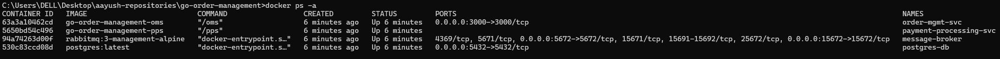
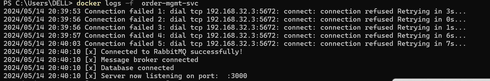
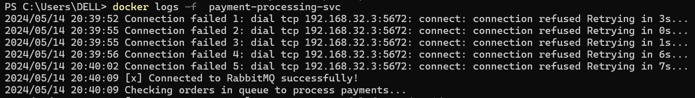

# Setup Guide
Setup guide for deploying go-order-management application, including all the necessary steps and commands. 

## Prerequisites
- [Docker](https://docs.docker.com/get-docker/) installed
- [Make](https://www.gnu.org/software/make/) utility installed
- [GO](https://go.dev/doc/install) installed
- Docker daemon is up and running

## Steps to Deploy

1. Navigate to the code directory:

    ```
    cd go-order-management
    ```

2. Execute the Make command:

    ```
    make run 
    ```
   
    Alternatively, following Docker command can be used:
    ```
    docker-compose up -d --build
    ```

    Note: This command will deploy four containers:
    Order management service
    Payment processing service
    RabbitMQ message broker
    PostgreSQL database

3. Verify deployed containers status using below mentioned command. 
  
    ```
      docker ps -a 
    ```
    Output:
    

    Wait for all the container statuses to be up as specified in the output image above.
   
4. Monitor service logs for the order management service and payment processing service using Docker logs:

    ```
      docker logs -f order-mgmt-svc
      docker logs -f payment-processing-svc
    ```
  
    Wait for the services to establish connection to database and rabbitmq.
    
    

  
5. Once the services are up, test the application using the following curl command:

    ```
      curl -X POST -H "Content-Type: application/json" -d '{"customerId": "1", "productId": "1", "quantity": 1}' "http://localhost:3000/orders"
    ```
 
6. Use the order_id returned by the above request to query the status:

    ```
      curl -X GET "http://localhost:3000/orders/<order_id>"
    ```
  
    Alternatively, Use the following shell script to continuously send create order requests to the service every 5 seconds.

    ```
      ./test/test.s
    ```

7. To stop the application, use the Make utility:

    ```  
      make stop
    ```

    Alternatively, you can use the following Docker command:

    ```
      docker-compose down
    ```
